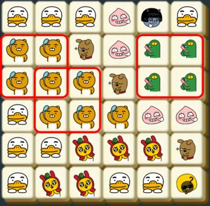

>[프렌즈4블록](https://programmers.co.kr/learn/courses/30/lessons/17679)

### 문제 소개
블라인드 공채를 통과한 신입 사원 라이언은 신규 게임 개발 업무를 맡게 되었다. 이번에 출시할 게임 제목은 "프렌즈4블록".
같은 모양의 카카오프렌즈 블록이 2×2 형태로 4개가 붙어있을 경우 사라지면서 점수를 얻는 게임이다.



만약 판이 위와 같이 주어질 경우, 라이언이 2×2로 배치된 7개 블록과 콘이 2×2로 배치된 4개 블록이 지워진다. 같은 블록은 여러 2×2에 포함될 수 있으며, 지워지는 조건에 만족하는 2×2 모양이 여러 개 있다면 한꺼번에 지워진다.

블록이 지워진 후에 위에 있는 블록이 아래로 떨어져 빈 공간을 채우게 된다.

만약 빈 공간을 채운 후에 다시 2×2 형태로 같은 모양의 블록이 모이면 다시 지워지고 떨어지고를 반복하게 된다.

```
TTTANT
RRFACC
RRRFCC
TRRRAA
TTMMMF
TMMTTJ
```

각 문자는 라이언(R), 무지(M), 어피치(A), 프로도(F), 네오(N), 튜브(T), 제이지(J), 콘(C)을 의미한다

입력으로 블록의 첫 배치가 주어졌을 때, 지워지는 블록은 모두 몇 개인지 판단하는 프로그램을 제작하라.


## 문제 풀이
구현에 집중한 문제로 각 기능에 따른 메소드로 모듈화하여 구현했다.
4블럭을 탐색 시에 현재 인덱스에서 아래, 오른쪽, 오른쪽대각선이 같은 블록인지 비교했다.

2개의 이상의 4블록이 겹친 케이스를 처리하기 위해 탐색 시에 바로 블록을 지워주지 않았고 이후 삭제 처리를 따로 했다.

마지막으로 블록 내리기!

```python
def down(m, n, board):
    for x in reversed(range(1, m)):
        for y in range(n):
            if board[x][y] == ' ':
                c_x = x
                while board[c_x][y] == " ":
                    c_x -= 1
                    if c_x < 1: break

                board[x] = board[x][:y] + board[c_x][y] + board[x][y+1:]
                board[c_x] = board[c_x][:y] + " " + board[c_x][y+1:]
                    

def deleting(board, t):
    for x, y in t:
        board[x] = board[x][:y] + " " + board[x][y+1:]
        
    t.clear()
    

def exploring(m, n, board, t):
    point = [(0,1), (1,0), (1,1)]
    
    for x in range(m-1):
        for y in range(n-1):
            if board[x][y] == ' ': continue
            four_B = True
            for p_x, p_y in point:
                if board[x][y] != board[x+p_x][y+p_y] :
                    four_B = False
                    break
            if four_B:
                t.add((x, y))
                for p_x, p_y in point:
                    t.add((x+p_x, y+p_y))
    return t


def solution(m, n, board):
    answer = 0
    t = set()
    exploring(m, n, board, t)
    
    while t:
        answer += len(t)
        deleting(board, t)
        down(m, n, board)
        exploring(m, n, board, t)   
    
    return answer
```