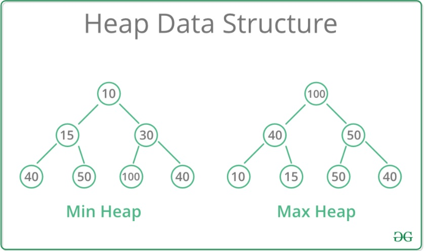

>[이중우선순위큐](https://programmers.co.kr/learn/courses/30/lessons/42628)

### 문제 소개
이중 우선순위 큐는 다음 연산을 할 수 있는 자료구조를 말합니다.

```python
명령어      수신 탑(높이)
I 숫자      큐에 주어진 숫자를 삽입합니다.
D 1         큐에서 최댓값을 삭제합니다.
D -1        큐에서 최솟값을 삭제합니다.
```

이중 우선순위 큐가 할 연산 operations가 매개변수로 주어질 때, 모든 연산을 처리한 후 큐가 비어있으면 `[0,0]` 비어있지 않으면 `[최댓값, 최솟값]`을 return 하도록 solution 함수를 구현해주세요.


## 시나리오
힙의 특성만 잘 이용하면 되는 쉬운 문제다.

## 문제 풀이
```python
import heapq
def solution(operations):
    heap = []
    
    for operation in operations:
        command, n = operation.split()
        
        if command == 'I':
            heapq.heappush(heap, int(n))
        elif command == 'D' and heap:
            if n == '1':
                heap.pop()
            else:
                heapq.heappop(heap)
    if heap:
        heap.sort()
        return [heap[-1], heap[0]]
    else:
        return [0,0]
```

## 회고
코드의 마지막에 `[최댓값, 최솟값]` 반환하기 위해 힙을 정렬하는 부분이 있다. 힙은 우선순위에 따라 값을 저장해두기 때문에 따로 정렬하지 않아도 삽입 시에 정렬된 상태로 만들어준다고 생각했다. 하지만 이건 큰 오산이였다.

힙은 완전 이진 트리로 구성된다. 


여기서 정렬된 배열과 다른 점을 확인할 수 있다. 위의 Min Heap의 숫자들이 정렬된 배열에 담겨있다면 다음과 같을 것이다.

```python
# 정렬된 배열
[10, 15, 30, 40, 40, 50, 100]
```

하지만 최소 힙에 들어가있다라고 한다면
```python
# 최소 힙
[10, 15, 30, 40, 50, 100, 40]
```
Level k에 따른 인덱싱으로 자식 노드를 찾아갈 것이다. 여기서 정렬된 배열과 최소 힙 배열의 차이점을 확인할 수 있었다. 

**Q. 완전 이진 트리의 최소 힙이 반드시 정렬된 상태가 아닌 이유는 무엇일까?**

**A.자식 노드가 부모 노드보다 크지만 않으면 완전 이진 트리로서 문제가 없기 때문이다.**

예를 들어, 위의 Heap Data Structure에서 30, 100, 40과 같은 구조이다. 자식 노드인 100, 40이 부모 노드인 30보다 크다면 자식 노드들의 순서는 상관없이 삽입된다.

**Q.최소 힙에서 최소값을 추출했을 땐 어떻게 될까?**

최소 힙의 최소값은 루트 노드이다. 즉, 루트 노드를 삭제하게 되면 다음과 같이 재정렬 된다.

1. 루트 노드 삭제
2. 맨 마지막 노드를 루트 노드 위치로 전환
3. 부모 노드와 자식 노드를 비교해가며 노드를 탐색해감
4. 자식 노드가 없거나, 자식 노드가 작지 않은 경우 종료

문제의 `[최댓값, 최솟값]`을 반환하기 위해서 힙의 구조를 찾아봤고 생겨난 의문점들을 답해가는 과정이 많이 도움이 됐다.😄