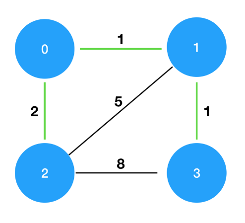

>[섬 연결하기](https://programmers.co.kr/learn/courses/30/lessons/42861)

### 문제 소개
n개의 섬 사이에 다리를 건설하는 비용(costs)이 주어질 때, 최소의 비용으로 모든 섬이 서로 통행 가능하도록 만들 때 필요한 최소 비용을 return 하도록 solution을 완성하세요.

다리를 여러 번 건너더라도, 도달할 수만 있으면 통행 가능하다고 봅니다. 예를 들어 A 섬과 B 섬 사이에 다리가 있고, B 섬과 C 섬 사이에 다리가 있으면 A 섬과 C 섬은 서로 통행 가능합니다.



## 시나리오
비용이 적은 순서로 정렬 후 연결할 수 있는 섬을 찾아 연결한다. 모든 섬을 연결하기 때문에 시작 섬은 상관 없다.

풀이할 때는 탐욕법 알고리즘 형태를 적용하자라는 생각으로 풀이했는데 나중에 다른 사람들의 풀이를 보니 탐욕법의 Kruskal 알고리즘 문제라고 한다. 알고 보니 나의 풀이도 Kruskal 알고리즘이랑 같았다.

## Kruskal 알고리즘이란
탐욕법을 이용하여 네트워크의 모든 정점을 최소 비용으로 연결하는 최적의 답을 구하는 방식이다.

간선 선택을 기반으로 하는 알고리즘이고 간선을 선택하는 기준은 다음과 같다. 

1. 가장 낮은 가중치의 간선을 먼저 선택한다.
2. 사이클을 형성하는 간선은 선택하지 않는다.


## 문제 풀이
입력되는 costs는 두 개의 섬과 가중치를 갖고 있는 간선 배열이랑 다름이 없다. Kruskal 알고리즘을 문제에 적용시켜 설명하면 사이클을 형성하는 간선은 costs의 두 개의 섬이 모두 bridge(이미 연결된 섬을 저장하는 set)에 포함되어 있는 경우에 속한다. 연결할 수 있는 간선을 하나 선택한 후 다시 처음부터 연결할 수 있는 간선을 탐색해 간다.

시작 섬은 어떤 섬이 되어도 상관없다. 이미 비용을 기준으로 정렬했기 때문에 시작 섬과 연결할 수 있고 가중치가 가장 작은 간선을 선택할 것이다. 

결국 어떤 섬에서 시작하더라도 선택되는 간선들은 같다.

```python
def solution(n, costs):
    answer = 0
    bridge = set([0])
    costs.sort(key=lambda x: x[2])    
    
    while len(bridge) != n:
        for x, y, c in costs:
            if x in bridge and y not in bridge:
                answer += c
                bridge.add(y)
                break
            elif x not in bridge and y in bridge:
                answer+= c
                bridge.add(x)
                break
        
    return answer
```


