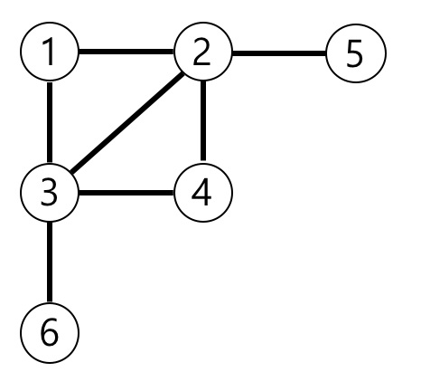
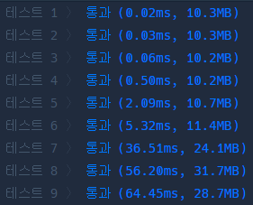
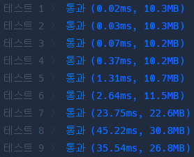

>[가장 먼 노드](https://programmers.co.kr/learn/courses/30/lessons/49189)

### 문제 소개
n개의 노드가 있는 그래프가 있습니다. 각 노드는 1부터 n까지 번호가 적혀있습니다. 1번 노드에서 가장 멀리 떨어진 노드의 갯수를 구하려고 합니다. 가장 멀리 떨어진 노드란 최단경로로 이동했을 때 간선의 개수가 가장 많은 노드들을 의미합니다.

노드의 개수 n, 간선에 대한 정보가 담긴 2차원 배열 vertex가 매개변수로 주어질 때, 1번 노드로부터 가장 멀리 떨어진 노드가 몇 개인지를 return 하도록 solution 함수를 작성해주세요.


## 시나리오
1. 입력 받은 양방향 노드를 보기 쉽게 정리한다.
2. 시작 지점에 연결된 노드들을 큐에 넣고 처리한다.
3. 큐에서 하나씩 꺼내 연결된 노드들을 다음과 같이 처리
    - 이미 방문하지 않은 노드의 경우 방문 표시와 함께 현재까지의 간선 갯수 + 1을 저장
    - 이미 방문한 노드일 경우 큐에 삽입 X

그래프를 탐색할 때 DFS가 아닌 BFS로 탐색하기 때문에 제일 방문 표시를 할 때 저장하는 간선 갯수가 최소 비용이다.

만약 DFS로 탐색 했다면 이미 방문한 노드일지라도 현재까지의 비용이 최소 비용인지 비교해야 한다.

## 문제 풀이
1. 딕셔너리를 활용

```python
from collections import deque

def solution(n, edge):
    start = 1
    graph, visited = dict() ,{1:0}
    queue = deque()

    # 그래프화
    for x, y in edge:
        if x in graph:
            graph[x].add(y)
        else:
            graph[x] = set([y])
        if y in graph:
            graph[y].add(x)
        else:
            graph[y] = set([x])
    
    # 시작 지점과 연결된 노드 처리
    for node in graph[1]:
        queue.appendleft((node, 1))
        visited[node] = 1
        
    # 탐색
    while queue:
        now, cost = queue.pop()
        for next_node in graph[now]:
            if next_node not in visited:
                visited[next_node] = cost + 1
                queue.appendleft((next_node, cost + 1))
            else:
                if visited[next_node] > cost + 1:
                    visited[next_node] = cost + 1

    return list(visited.values()).count(max(visited.values()))
```



딕셔너리를 사용했을 때 직관성이 좋아 풀이가 수월한 감이 있었다. 하지만 리스트보다 메모리를 많이 소모한다는 것을 알고 있었기 때문에 공간 복잡도를 줄이고자 한다.

또한 큐에 삽입할 때 굳이 비용을 같이 넣을 필요가 없다는 것을 깨달았다. 이전의 노드에서 +1만 해주면 현재 간선까지의 비용이 되기 때문에 큐에 넣을 때 비용처리와 방문처리를 해주고, 큐에는 다음 노드만 넣어보려 한다.


2. 첫 번째 풀이

```python
from collections import deque

def solution(n, edge):
    start = 1
    graph = [set() for _ in range(n+1)]
    costs = [0 for _ in range(n+1)]
    visited = [False for _ in range(n+1)]
    queue = deque()
    
    # 그래프화
    for x, y in edge:
        graph[x].add(y)
        graph[y].add(x)
        
    # 시작 지점과 연결된 노드 처리
    visited[start] = True
    for node in graph[start]:
        queue.appendleft(node)
        costs[node] = 1
        visited[node] = True
        
    # 탐색
    while queue:
        now = queue.pop()
        
        for next_node in graph[now]:
            if not visited[next_node]:
                queue.appendleft(next_node)
                visited[next_node] = True
                costs[next_node] = costs[now] + 1
    
    return costs.count(max(costs))
```




시간 복잡도가 현저히 줄어든 것을 확인할 수 있었다.