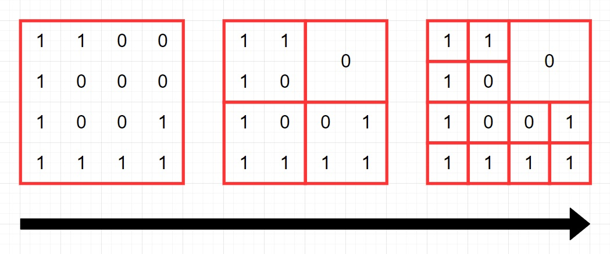

>[쿼드압축 후 개수 세기](https://programmers.co.kr/learn/courses/30/lessons/68936)

### 문제 소개
0과 1로 이루어진 2n x 2n 크기의 2차원 정수 배열 arr이 있습니다. 당신은 이 arr을 쿼드 트리와 같은 방식으로 압축하고자 합니다. 구체적인 방식은 다음과 같습니다.

1. 당신이 압축하고자 하는 특정 영역을 S라고 정의합니다.
2. 만약 S 내부에 있는 모든 수가 같은 값이라면, S를 해당 수 하나로 압축시킵니다.
3. 그렇지 않다면, S를 정확히 4개의 균일한 정사각형 영역(입출력 예를 참고해주시기 바랍니다.)으로 쪼갠 뒤, 각 정사각형 영역에 대해 같은 방식의 압축을 시도합니다.

arr이 매개변수로 주어집니다. 위와 같은 방식으로 arr을 압축했을 때, 배열에 최종적으로 남는 0의 개수와 1의 개수를 배열에 담아서 return 하도록 solution 함수를 완성해주세요.



## 시나리오
먼저 재귀 방식으로 풀이했다. 하나의 블록인지 먼저 탐색하고 압축할 수 없다면 4분할하여 좌표를 넘겨주었다. 

기준점이 되는 위치와 블록의 크기를 매개변수로 넘긴다.
- 기준점 (0, 0), 블록의 크기 4인 블록을 압축할 수 없다면, 크기가 2이며 (0, 0), (0, 4), (4, 0), (4, 4)의 4개의 기준점으로 분할됨을 의미한다.


## 문제 풀이
1. 재귀

```python
zero, one = 0, 0

def quad_block(x, y, size, arr):
    global zero, one
        
    # 하나의 블록인지 탐색
    for t_x in range(x, x + size):
        for t_y in range(y, y + size):
            if arr[x][y] != arr[t_x][t_y]:
                loc = [(x, y), (x, y+size//2), (x+size//2, y), (x+size//2, y+size//2)]
        
                for i in range(4):
                    quad_block(loc[i][0], loc[i][1], size//2, arr)
                return
    
    if arr[x][y] == 1:
        one += 1
    else:
        zero += 1
    return
            
        
def solution(arr):
    global zero, one
    
    quad_block(0,0,len(arr),arr)
    
    return [zero, one]
```

2. 반복문

```python
def solution(arr):
    zero, one = 0, 0
    stack = [(0, 0, len(arr))]
    
    while stack:
        x, y, size = stack.pop()
        is_block = True
        
        # 하나의 블록인지 탐색
        for t_x in range(x, x + size):
            for t_y in range(y, y + size):
                if arr[x][y] != arr[t_x][t_y]:
                    is_block = False
                    break
            if not is_block: break
        
        # 4분할
        if not is_block:
            loc = [(x, y), (x, y+size//2), (x+size//2, y), (x+size//2, y+size//2)]

            for i in range(4):
                stack.append((loc[i][0], loc[i][1], size//2))
        else:
            if arr[x][y] == 1:
                one += 1
            else:
                zero += 1
    
    return [zero, one]
```

