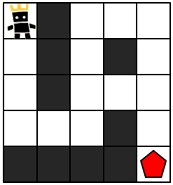
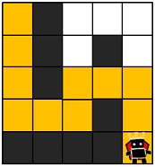
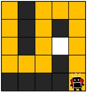

>[게임 맵 최단거리 (Level 2)](https://programmers.co.kr/learn/courses/30/lessons/1844)

### 문제 소개

다음과 같은 Map이 주어진다. 시작점 (0, 0) 에서 출발하여 도착점 (5, 5) (배열의 Size)까지 도달하기 위한 최소 이동거리를 구하는 문제이다.



```
Input: [[1,0,1,1,1],[1,0,1,0,1],[1,0,1,1,1],[1,1,1,0,1],[0,0,0,0,1]]
Output: 11
```
1. 이동거리는 11로 최단거리 도착함 - 정답   

2. 이동거리 15로 최단거리인 11보다 멀다. - 오답   


## 문제 풀이
처음 문제를 읽었을 때 BFS를 써야할지 DFS를 써야할지 감이 오지 않아 시나리오를 작성했다.

**DFS로 풀이하였을 때**, 도착점을 찾아 한번 출발하면 길이 막히거나 도착점에 도달할 때까지 진행한다. 갈림길을 만나면 한 쪽을 선택하여 종료 조건에 포함될 때까지 이동한다. 때문에 모든 길의 거리를 확인할 수 있다.

**BFS로 풀이할 경우**, 갈림길을 만나면 모든 길을 큐에 넣고 같은 이동거리를 할당한다. 때문에 모든 길을 한 차레씩 이동한다. 

목표는 최단거리를 구하는 것이기 때문에, BFS로 풀이하여 갈림길을 한 차레씩 이동해보며 가장 먼저 목표점에 도착하는 이동거리를 반환한다. 

```python
from collections import deque

def solution(maps):
    queue = deque()
    queue.appendleft([0,0,1])

    return bfs(maps, queue)


def bfs(maps, queue):
    x, y, count = queue.pop()
    maps[x][y] = 0

    if x == len(maps)-1 and y == len(maps[0])-1:
        return count

    if x - 1 >= 0 and maps[x-1][y] == 1:
        queue.appendleft([x-1,y,count+1])
    if x + 1 <= len(maps)-1 and maps[x+1][y] == 1:
        queue.appendleft([x+1,y,count+1])
    if y - 1 >= 0 and maps[x][y-1] == 1:
        queue.appendleft([x,y-1,count+1])
    if y + 1 <= len(maps[0])-1 and maps[x][y+1] == 1:
        queue.appendleft([x,y+1,count+1])

    if len(queue) == 0:
        return -1

    return bfs(maps, queue)
```
먼저, BFS를 함수로 구현했다. 특이사항이 발생했는데, 정확도 테스트는 통과하더라도 효율성 테스트에서 모두 런타임 에러를 발생시켰다. 당연히 실패하더라도 시간 초과가 발생할 줄 알았는데 런타임 에러라고 해서 당황했다. 

처음엔 List out of index 오류이겠거니 하고 오류가 발생할만한 부분을 찾아보았다. 생각해보니 정확도 테스트를 통과하지 못했을텐데...

오류 발생 원인을 여럿 찾아보던 바에 Map의 크기가 커질 수록, 함수 호출을 위한 Call Stack이 한계를 넘었다는 것을 알 수 있었다. (가로, 세로 11칸 정도만 되어도 Maximum call stack size exceeded 에러가 발생)

원인을 제대로 파악할 수 있어서 안도하며 반복문으로 변경했다👍

```python
from collections import deque

def solution(maps):
    queue = deque()
    queue.appendleft([0,0,1])
    result = -1
    x_size, y_size = len(maps), len(maps[0])
    
    while(len(queue) != 0):
        x, y, count = queue.pop()

        if x == x_size-1 and y == y_size-1:
            result = count
        
        if x - 1 >= 0 and maps[x-1][y] == 1:
            queue.appendleft([x-1,y,count+1])
            maps[x-1][y] = 0
        if x + 1 <= x_size-1 and maps[x+1][y] == 1:
            queue.appendleft([x+1,y,count+1])
            maps[x+1][y] = 0
        if y - 1 >= 0 and maps[x][y-1] == 1:
            queue.appendleft([x,y-1,count+1])
            maps[x][y-1] = 0
        if y + 1 <= y_size-1 and maps[x][y+1] == 1:
            queue.appendleft([x,y+1,count+1])
            maps[x][y+1] = 0
    
    return result
```
반복문으로 변경했지만 시간 초과가 계속 발생했다.😪 

그 동안은 큐에서 다음 이동장소를 꺼냈을 때 방문했었다고 표시했는데, 다음 길을 찾고 큐에 넣을 때, 모두 방문 표시를 하였다. 

해결!

## 회고
이번 문제로 BFS는 큐를 사용한 선입선출(FIFO)방식으로 구현하고, DFS는 후입선출(LIFO)로 주로 구현한다는 말을 이해했다. 아직은 알고리즘 구조를 짜는데 시간이 걸리는 것 같다. 앞으로 문제를 풀이할 때 조금 더 인식하면서 구조를 정립해갈 예정이다.😎