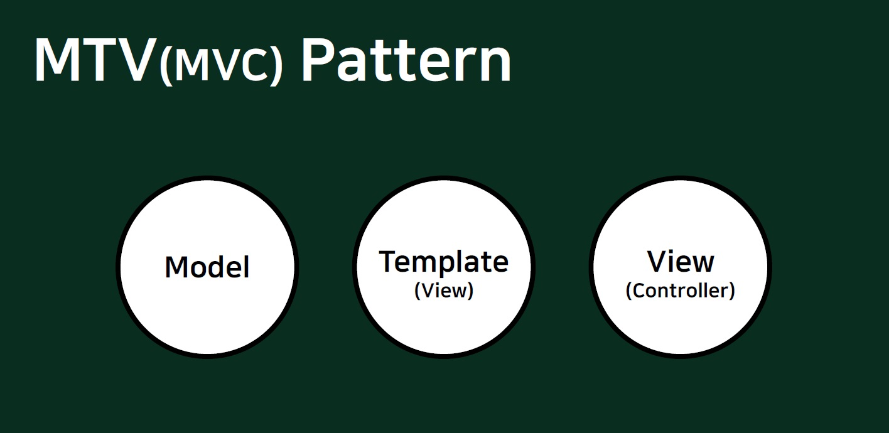
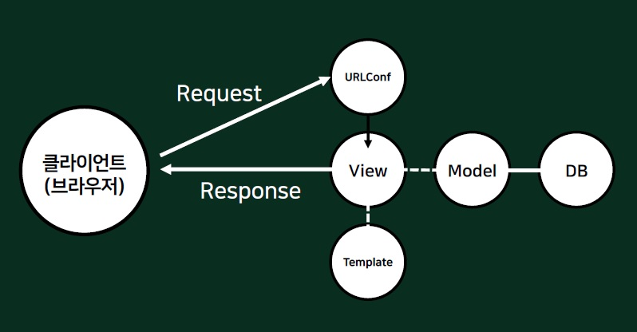

Django 프레임워크에선 웹 개발시에 MTV 패턴을 사용하여 설계한다.
처음엔 위와 같은 모듈의 분할과 방식의 필요성에 대해 의문이 들었다. 

## 모듈화
프로그래밍에 관심을 갖다보니 **모듈화**, **캡슐화**의 중요성에 대해 끊임 없이 들었다. 프로그래밍은 한 두개의 파일들만 사용하여 실행되는 것이 아니기 때문에 **구현하고자 하는 프로그램 코드를 기능별로 적절히 나눠서 파일로 저장하는 것**을 모듈화라고 한다. 모듈화를 하게 되면 파일들끼리 주고받는 영향을 최소화 시켜서 관리하기 쉽고 협업을 할 때도 효율적으로 사용할 수 있다.
>사람도 자신의 일이 아닌 것을 계속 시키면 불평하지 않는가!

---

Django에서도 MTV 패턴을 사용함으로서 모듈 간에 독립성을 유지할 수 있다. 때문에 서로에게 주는 영향을 최대한 감소시키고 디자인, 개발, DB를 따로 관리할 수 있게 된다. 이것으로 MTV 패턴의 필요성을 충분히 이해할 수 있었다.

이제 각각의 MTV를 자세히 살펴보려고 한다.

앞의 글에서 [[WEB]Request, Response](https://rnjsrntkd95.github.io/django/request-response/)를 알아보았다. 클라이언트가 보낸 Request에 대해 서버는 Response를 보내야한다. MTV패턴은 해당 Response를 생성할 때 적용된다. **Model**은 데이터베이스로부터 데이터를 가져오거나 저장, 수정하는 기능을 하고, **Template**은 Response의 양식이 담긴 페이지를 만들어주는 기능을 한다. **View**는 Model에서 가져운 데이터를 적절하게 변환하여 Template에게 전달하는 기능을 한다. Model과 Template를 연결해준다고 생각할 수 있다. 

>MTV 패턴의 적용 예시를 생각해보았다.
>>1. 네이버의 서버로 클라이언트가 입력한 '장고'의 Request 객체가 전달될 것이다.
>>2. 서버는 이 Request 객체에 대한 Response 객체를 만든다.
>>    - Model이 DB로부터 '장고'를 검색한 결과 데이터를 가져온다.
>>    - Template은 검색 결과를 보여줄 양식 페이지를 만들어준다.
>>    -  View는 Model의 데이터를 Template의 양식 페이지에 맞게 변환하여 대입한다.
>>3. 서버는 클라이언트에게 Response 객체를 전달한다.  