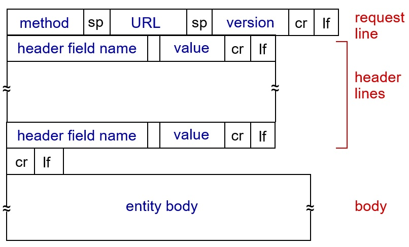

HTTP(Hypertext Transfer Protocol)는 하나의 통신 프로토콜이다. 정의한 규칙을 토대로 데이터를 주고 받기 위해 사용된다. 웹에서는 브라우저와 서버가 HTTP 프로토콜을 사용하여 데이터를 주고 받게 된다.

## HTTP method란?
클라이언트가 서버에게 Request를 보낼 때 사용자 요청의 목적/종류를 알리는 수단이다. method는 GET, POST, PUT, DELETE, ... 있지만 주로 사용하는 **GET**과 **POST**에 대해서 정리해보겠다.

먼저 HTTP request 메시지의 구조를 살펴보자.

> **HTTP Request message format**

request 메시지 구조는 크게 <U>**헤더(Header)**</U>와 <U>**바디(Body)**</U>로 나뉘어진다. 헤더에는 클라이언트 정보가 담기고 이것을 메타정보라고 한다. 바디에는 요청에 대한 요청에 대한 정보가 담기고 보통은 비어있다.

주목해야할 부분은 헤더 첫 줄의 request line이다. method 파트에 GET 또는 POST 등이 표현되고 공백을 두고 URL, HTTP version이 표현된다. 마지막엔 cr(carriage return), lf(line feed)를 두었고 줄바꿈(\r\n)을 의미한다.

`"GET /shop/index.html HTTP/1.1"`  

우리는 위와 같은 메시지를 보고 클라이언트가 HTTP 1.1버전을 사용해서 GET방식으로 요청을 보냈다는 것을 알아낼 수 있다.
 
## GET
GET 메소드는 서버에게 리소스를 보내도록 요청하는데 사용된다.
특이한 점은 데이터를 바디가 아닌 헤더의 **URL에 붙여서 전송**한다는 점이다. 

평소에 URL을 보다보면 ? 뒤에 이것저것이 적혀있는 것을 본적이 있을 것이다. 이것은 Query String의 형식으로 데이터를 ? 연산자 뒤에 변수와 값을 넣어서 보내는 형식이다. 값이 URL에 담기기 때문에 우리가 보고 있는 화면의 정보를 모두 담아 쉽게 공유할 수 있다. 하지만 눈에 쉽게 보이다 보니 보안에 취약하다고 볼 수 있다. 
> 만약 로그인을 하는데 GET 방식을 사용하고 있다면 우리가 입력한 ID와 PASSWORD가 URL에 노출될 것이다

## POST
POST 메소드는 HTTP의 바디에 데이터를 넣어 전송한다.
GET과는 다르게 요청내용을 바디에 저장하기 때문에 데이터가 노출되지 않는다. 주로 HTML form 형태로 입력을 받아 POST 방식으로 전송하게 된다. 또한 데이터의 길이가 길 경우 URL에 담기에는 무리가 있고 제한이 있기 때문에 길이에 제한이 없는 바디에 담아 전송한다.