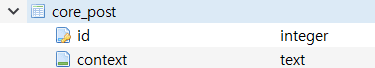
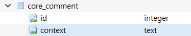
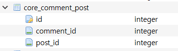

Django 모델을 공부하던 도중 모델들 간의 관계를 정의하는 과정에서 헷갈리는 부분이 있었다. 이번 기회에 데이터베이스 구성과 함께 정리해보려 한다.

모델에 작성자 클래스와 게시글 클래스를 정의하게 되면 작성자 테이블과 게시글 테이블이 DB에 정의된다. 여기서 ‘펭수’가 게시글을 하나 작성했다고 하자. 작성자 테이블에는 ‘펭수’에 대한 정보만 존재하고 게시글 테이블에는 게시글에 대한 정보만 담겨있기 때문에 어떤 게시글이 ‘펭수’가 작성한 게시글인지 알 수 없다. 이것을 표시하기 위한 것이 관계(Relationship)이다.

먼저 장고의 모델들 간의 관계는 3가지로 구분된다.

1. **OneToOneField** - 일대일[1:1] 관계
2. **ForeignKey** - 일대다[1:N] 관계
3. **ManyToManyField** - 일대다[N:M] 관계

## OneToOneField  
***한 명의 작성자는 하나의 게시글만 작성할 수 있고, 하나의 게시글은 한 명의 작성자만 갖을 수 있다.***

일대일 관계에선 한쪽의 테이블이 상대 테이블에 대한 키값을 갖는다. 게시글 테이블에서 작성자에 대한 키값을 갖고 있게 되면 이 게시글이 어떤 작성자가 작성한 것인지 확인할 수 있고 그 키값을 가지고 작성자 테이블에서 작성자에 대한 데이터도 찾을 수 있다. 장고에서는 이 키값을 보통 ID(PrimaryKey)로 가져오는 것 같다.

>PrimaryKey - 테이블에서 데이터를 유일하게 식별할 수 있도록 하는 하나의 속성

OneToOneField는 이 관계를 1:1로만 매칭할 수 있다.

>데이터베이스에서는 일대일 관계일 경우 어느 테이블이 키값을 가져도 상관없다.

## ForeignKey  
***한 명의 작성자는 여러개의 게시글을 작성할 수 있고, 하나의 게시글은 여러명의 작성자를 갖을 수 있다.***

ForeignKey는 테이블끼리 1:N로 매칭한다. OneToOneField와 다른 점은 OneToOneField는 어느 테이블이 키값을 가지고 있어도 상관이 없었다면 일대다 관계인 ForeignKey에선 1:N 중 ‘N’인 테이블에서 키값을 갖게 된다. (‘1’인 테이블에서 키값을 갖게 되면 하나의 속성의 여러개의 ID값을 저장해두어야 하는데 DB에선 다중값 속성은 속성의 원자성에 위배된다.)

## ManyToManyField  
***여러명의 작성자는 여러개의 게시글을 작성할 수 있고, 여러개의 게시글은 여러명의 작성자를 갖을 수 있다.***

이 글을 작성한 이유는 바로 다대다 관계인 ManyToManyfield 때문이였다. 장고에서는 위의 OneToOneField, ForeignKey와 모델값을 정의하는 법은 같기 때문에 N:M만 이해한다면 비슷하다고 생각할 수 있다. 하지만 N:M 관계를 맺을 경우 게시글 테이블 또는 작성자 테이블에서 키값을 가지고 있는 것이 아닌 게시글의 키값과 작성자의 키값을 갖고 있는 새로운 테이블을 만든다.

처음 ManyToManyField를 알게되었을 때에는 장고 모델만 봐서는 새로운 테이블을 만드는 과정이 없고 한쪽의 모델에서 ManyToManyField만 사용하는 것을 보고 패닉이 왔었다. 분명 새로운 테이블을 만들어야 속성의 원자성을 위배하지 않고 DB를 관리할 수 있을 텐데라는 걱정이 있었다. 하지만 장고에서는 migrate라는 과정이 있었다.

모델을 migrate하면 모델에 정의된 내용을 데이터베이스의 쿼리문으로 변경해서 연결된 DB에 반영하고 테이블을 만든다. 직접 DB에 들어가서 확인해보니 역시나 새로운 두 테이블에 대한 키값을 가지고 있는 새로운 테이블을 만들었다.

>POST 테이블

>COMMENT 테이블

두 테이블에서는 서로에 대한 키값은 일절 저장해두지 않는다.

>새로운 테이블

새로운 테이블이 생성되고 두 테이블에 대한 키값(ID)으로 구성된다. 이렇게 장고에서 한 쪽 Model 클래스에 일방적으로 ManyToManyField를 정의하더라도 쿼리문을 만드는 과정에서 새로운 테이블을 만드는 쿼리문을 센스있게 구성해주는 것 같다. 이로써 모델에서 직접 만들어주지 않아도 편리하게 사용할 수 있다.

***만약 새로 만들어지는 테이블에 설명속성을 추가하고 싶다면 through라는 파라매터를 공부해보길 바란다!***