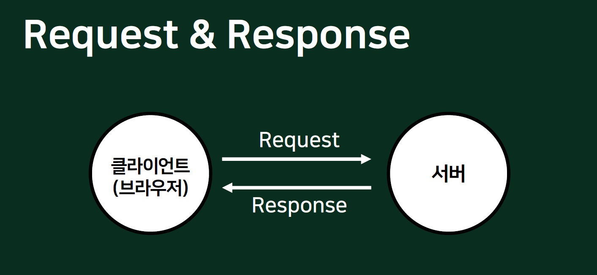

Request는 요청, Response는 응답이라는 뜻이다. 단어의 뜻만 들어서는 웹에서 요청과 응답이 어떻게 흘러가지 아직은 알 길이 없다. 실생활에서 예를 찾아보았다.

>펭수와 펭수친구인 물개가 있다고 하자. 펭수가 검지손가락으로 물개의 허리를 찔렀다. 그러자 물개는 "물개!" 하며 꼬리를 튕겨 펭수의 뺨을 쳤다. 

여기서도 Request와 Response를 확인할 수 있다. 펭수가 손가락으로 찌르면서 물개에게 Request를 보냈다. 물개는 펭수의 Request를 받아 그에 맞는 Response인 꼬리를 튕겼다.

이러한 과정이 웹에서 빈번하게 발생한다. 클라이언트가 홈페이지의 '회원가입' 버튼을 눌러 Request를 보낸다. 그러면 서버는 회원가입에 필요한 양식이 담긴 페이지의 주소(URL)를 Response로 보내온다. 이렇듯 Request & Response를 쉽게 이해해볼 수 있겠다.

### Request 객체
클라이언트가 서버에 어떤 정보를 요청하는 것이 Request이며 이 요청 정보를 관리하는 것이 Request 객체이다.

### Response 객체
클라이언트의 Request에 응답하는 것을 Response라고 하며 이러한 응답 정보를 관리하는 것이 Response 객체이다.

